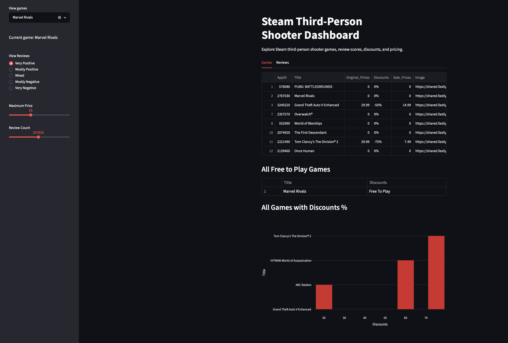
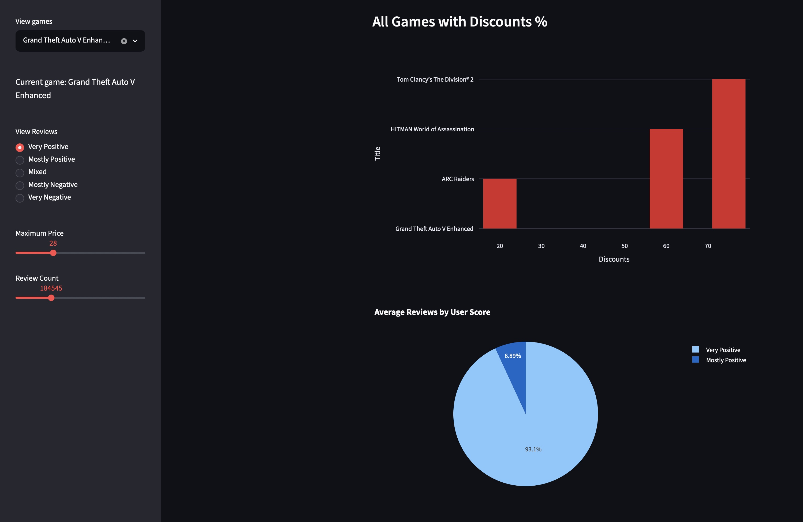

# Steam TPS Scraper Dashboard

## Overview
This project scrapes Steam third-person shooter game data using Selenium,
cleans the data with Pandas, stores it in SQLite, and visualizes it using Streamlit.

## Dataset

The dataset contains Steam third-person shooter games including:
- Game title
- Original price
- Sale price
- Discount percentage
- User review score
- User review count

## Features
- Steam web scraping
- Data cleaning and transformation
- SQLite database
- Interactive Streamlit dashboard
- Filters by game, review score, and price

## Installation

pip install -r requirements.txt

## Run Scraper

python scrape.py

## Run Cleaning Script

python clean.py

## Run Dashboard

streamlit run dashboard_app.py

## Screenshots

## Dashboard Overview

## Interactive Review Filtering

